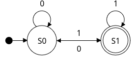

# fsm.c
A simple FSM interpreter made in C. It interprets a file with the FSM definition and tests if a passed string is accepted by the FSM.

## What is an FSM?
*TODO*

## Definition of an FSM
The FSM have the following components:

1. States: define the states
2. Alphabet: define the alphabet (possible symbols)
3. Transitions: define the transitions between states depending on the symbol
4. Start state: define the initial state
5. Accept states: define the states where the input string is accepted by the FSM

## The FSM grammar
The FSM grammar is defined as follows:

### Tokens
```
<ident> = [a-zA-Z][a-zA-Z0-9]*
<char> = [a-zA-Z0-9]
<eof> = '\0'
```

### Grammar
```
init: <ident> '=' fsm <eof>
fsm: '(' fsm_def ')' | fsm_def
fsm_def: states ';' alphabet ';' transitions ';' <char> ';' accept
states: '{' state_list '}' | state_list
state_list: <ident> (',' <ident>)*
alphabet: '{' alpha_list '}' | alpha_list
alpha_list: <char> (',' <char>)*
transitions: '{' trans_list '}' | trans_list
trans_list: trans_def ('|' trans_def)*
trans_def: <ident> ',' <char> ',' <ident>
accept: <ident> (',' <ident>)*
```

### Example
A simple example of an FSM definition file:
```
lastMustBeOne=(
    s0,s1;
    0,1;
    {
        s0,0,s0|
        s0,1,s1|
        s1,0,s0|
        s1,1,s1
    };
    s0;
    s1
)
```
This FSM validates strings that ends with 1.

This is the graphical representation of lastMustBeOne FSM:



*Made with [FSM Simulator](http://fsm-simulator.info/) \*NO HTTPS\**

## How to run

### Build
Run in the terminal:
```bash
$ ./build.sh
```

### Run
After building run in the terminal:
```bash
$ cd build
$ ./fsm <input_file> <test_string>
```

